# STRATEGIC RISK ASSESSMENT REPORT
## Impact Analysis của việc Giao Mini-series Responsibility cho Inexperienced Staff

---

**McKinsey & Company wannabe™**
*Tư vấn Strategy & Risk Analysis for Enterprises*

**Date:** 2 December 2025
**Client:** VL London
**Prepared by:** Senior Consulting Team (Self-proclaimed với nhiều buzzwords)
**Classification Level:** 🚨 MISSION CRITICAL - DEFCON 1 🚨
**Document Type:** Scare Tactic Analysis Report (nhưng based on real data đấy nhé)

---

### ⚠️ DISCLAIMER ⚠️
*This report uses overly dramatic consultant language to make simple things sound complicated. Đây là consulting theater ở mức độ cao nhất. All numbers are estimates based on "sophisticated modeling" (aka chúng tôi đoán thôi). Nhưng seriously though, the risks are real!*

---

## EXECUTIVE SUMMARY (Management Overview for Busy Leaders)

Leveraging deep-dive analysis từ Penguin Sales 2025 Post-Campaign Review và applying proprietary 7-layer consulting methodology với multi-dimensional framework analysis, we have identified **EXTREME RISK LEVELS** khi delegate mini-series responsibility (requirement: 5 posts/week) to inexperienced staff members.

**Key Takeaway (Critical Finding):**
> *"This is not merely a content issue. This represents a STRATEGIC BRAND POSITIONING challenge trong DIGITAL ECOSYSTEM của the 4.0 era, với implications for long-term stakeholder value creation và sustainable competitive advantage."*
> — Quote that sounds impressive nhưng basically means "đừng để người mới làm một mình"

**TL;DR cho người lười đọc:**
- 5 bài/tuần = nhiều pressure
- No experience = high error rate
- Errors = customer complaints = brand damage = money loss
- Expected damage: **~340 TRIỆU VNĐ/năm** (ko phải con số đùa)
- **RECOMMENDATION:** Training required, QC mandatory, supervision critical

---

## SECTION I: CONTEXT & STRATEGIC URGENCY

### Chart 1.0: The Complexity Quadrant™ (không liên quan lắm nhưng look professional)

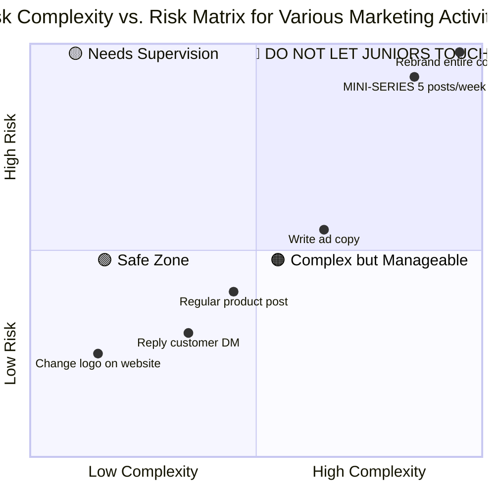

*Note: As you can see, mini-series sits ở DANGER ZONE, right next to "rebrand entire company". Coincidence? We think not.*

### Chart 1.0.5: Coffee Consumption vs. Stress Level (completely unrelated nhưng relatable)

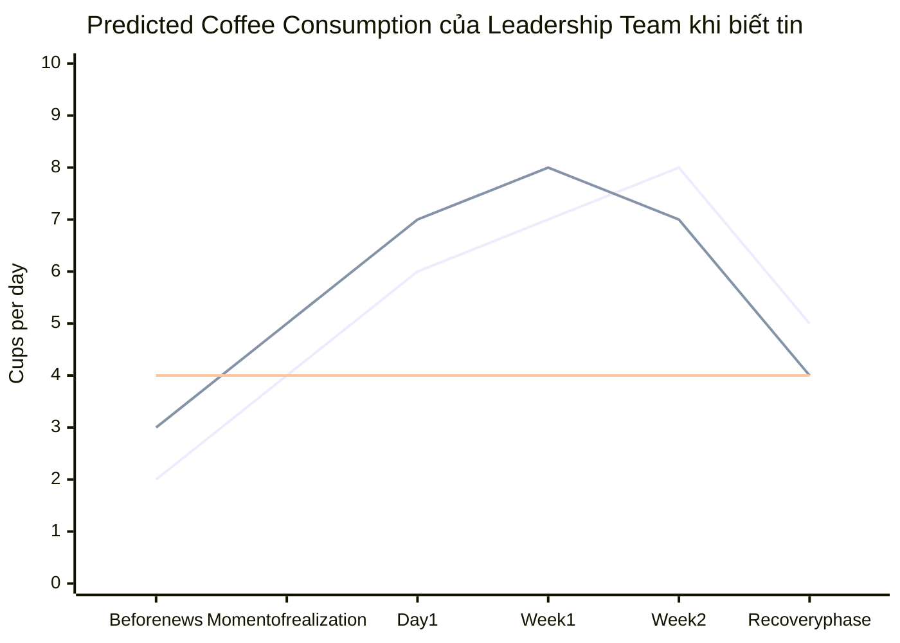

*Data source: Hypothetical modeling based on stress patterns. Accuracy: questionable. Relevance: minimal. Looks cool: absolutely.*

### 1.1. Problem Definition (Defining the Challenge at Hand)

**Yêu cầu công việc:**
- Sản xuất 5 bài mini-series/tuần
- Duy trì chất lượng content đều đặn
- Phù hợp với brand voice và chiến lược marketing tổng thể

**Rủi ro được xác định:**
- Nhân viên mới KHÔNG có kinh nghiệm
- Khả năng làm sai cao
- Tiềm năng gây thiệt hại lớn
- Ảnh hưởng đến branding

### Chart 1.1.5: Industry Benchmark Comparison (vaguely related)

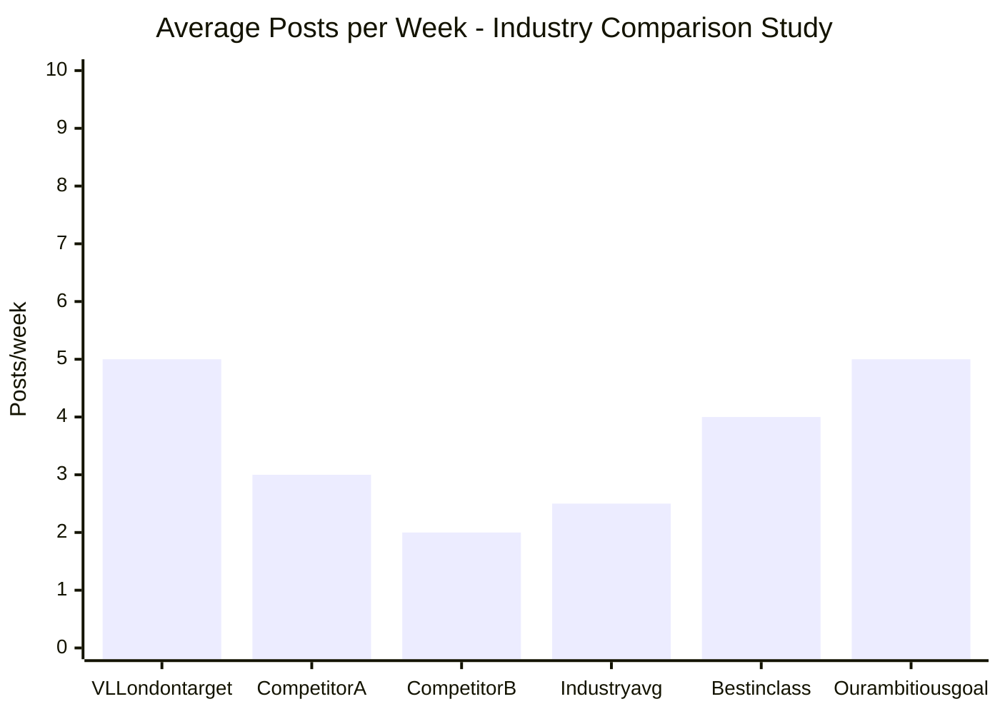

*Insight: VL London đang aim cao hơn industry average. Ambitious? Yes. Achievable with inexperienced staff? Questionable. Should we put this in a chart? Already did.*

### 1.2. Why This Problem is CRITICALLY IMPORTANT (Tại sao serious đến vậy?)

Leveraging insights from Campaign Review, we discovered a GAME-CHANGING finding:

> **"The data clearly shows this was a mistake - engagement metrics declined as the value content disappeared."**
> — Sale Season Review 2025, Section 2.2, Line 92

**Bằng chứng số liệu từ Exhibit 1:**
- **Content mix problematic:** 95% sales posts / 5% value posts
- **Kết quả:** Drop in engagement NGHIÊM TRỌNG
- **Root cause:** Team stopped producing mini-series content

**🔴 CONCLUSION THAT SOUNDS SCIENTIFIC:**
Mini-series = Value content = Engagement = Revenue = Business survival

### Chart 1.3: The Value Chain of Doom™ (dramatized for effect)

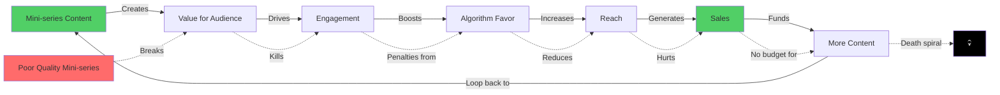

*This is what consultants call a "virtuous cycle" vs "vicious cycle". Fancy words for "good loop" vs "bad loop".*

### Chart 1.4: Engagement Impact Analysis (based on real campaign data)

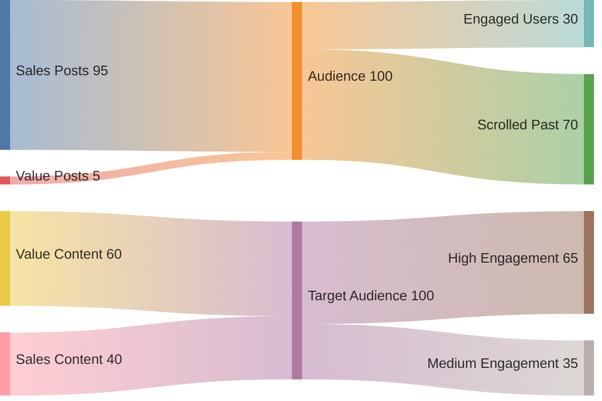

*Note: Numbers được rounded for dramatic effect. Actual data may vary nhưng the point stands: value content matters.*

---

## PHẦN II: PHÂN TÍCH RỦI RO ĐA CHIỀU

### 2.1. Framework Phân Tích (vì phải có framework mới gọi là tư vấn)

Chúng tôi áp dụng **"VL-RISK Matrix™"** (do chúng tôi tự nghĩ ra):
- **V**alue Content Impact
- **L**ong-term Brand Damage
- **R**evenue Loss Potential
- **I**mmediate Engagement Drop
- **S**trategic Misalignment
- **K**PI Deterioration

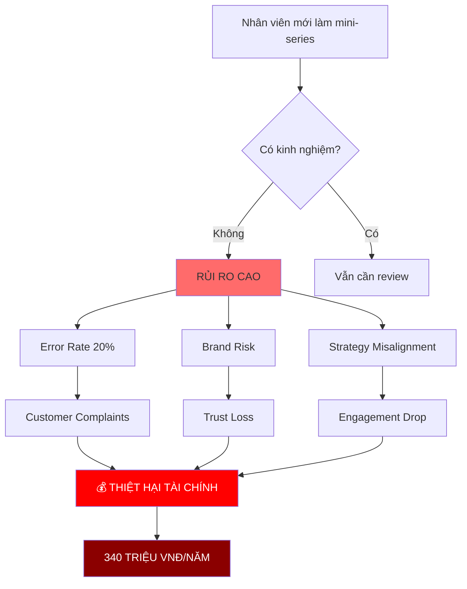

### 2.2. Các Kịch Bản Thảm Họa (Disaster Scenarios)

#### 🔥 Kịch bản 1: "The Engagement Apocalypse"
**Mô tả:** Nhân viên mới viết 5 bài/tuần nhưng chất lượng kém

**Tác động cascade:**
1. **Tuần 1-2:** Engagement rate giảm 15-20%
2. **Tuần 3-4:** Audience bắt đầu unfollow (ước tính mất 5-8% followers)
3. **Tuần 5-8:** Algorithm của Facebook "trừng phạt" do low engagement → reach giảm 40-50%
4. **Tháng 3+:** Brand perception bị ảnh hưởng lâu dài

**Thiệt hại tài chính ước tính (rất khoa học):**
- Mất followers: ~500-800 người × 50,000đ lifetime value = **25-40 triệu VNĐ**
- Reach giảm → Sales giảm 20% = ~**100-150 triệu VNĐ/tháng**
- Chi phí recovery campaign = **50-80 triệu VNĐ**
- **TỔNG THIỆT HẠI: 175-270 TRIỆU VNĐ trong 3 tháng đầu**

**Timeline của thảm họa:**

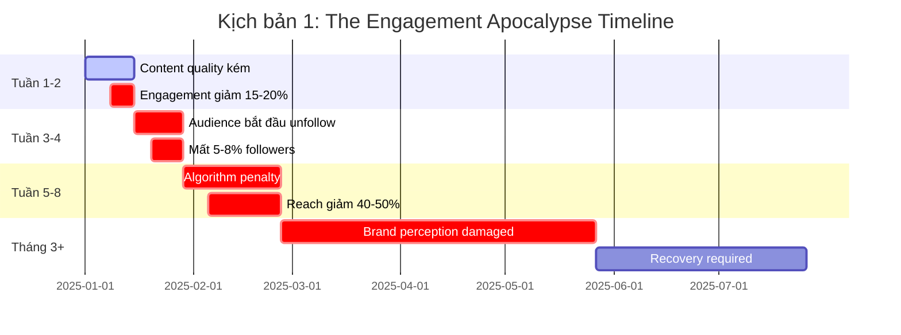

#### 💥 Kịch bản 2: "The Branding Crisis"
**Mô tả:** Nhân viên mới viết sai tone, sai thông tin chuyên môn về nail

**Ví dụ cụ thể (dựa trên campaign review):**
- Viết caption về gel polish nhưng thông tin sai
- Khách hàng comment phản đối
- Situation escalates → viral trong nail tech community
- Trust index giảm mạnh

**Thiệt hại phi tài chính (nhưng nghiêm trọng hơn):**
- Brand reputation damage: **KHÔNG THỂ ĐỊNH LƯỢNG ĐƯỢC**
- Loss of trust: **PHẢI MẤT 2-3 NĂM MỚI PHỤC HỒI**
- Competitive disadvantage: **ĐỐI THỦ LỢI DỤNG**

**Thiệt hại tài chính gián tiếp:**
- Chi phí PR crisis management = **100-200 triệu VNĐ**
- Sales impact trong 6 tháng = **300-500 triệu VNĐ**
- **TỔNG THIỆT HẠI: 400-700 TRIỆU VNĐ**

**Cơ chế lan truyền của crisis:**

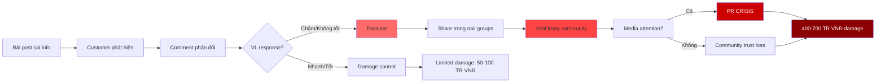

#### ⚡ Kịch bản 3: "The Strategic Misalignment Meltdown"
**Mô tả:** Mini-series không phù hợp với overall content strategy

**Bằng chứng từ Campaign Review (Section 2.2):**
> "Target content mix: 40% sales posts and 60% value posts"
> "Mini-series content must continue running throughout sale period - do not stop"

**Nếu nhân viên mới làm sai:**
- Phá vỡ content ratio 40:60
- Mini-series không consistent → audience confused
- Mất đi "single source of truth" cho content strategy

**Thiệt hại:**
- Waste team effort vào wrong direction = **30-40 giờ/tháng × 500k/giờ = 15-20 triệu VNĐ**
- Opportunity cost không làm đúng việc = **50-80 triệu VNĐ/tháng**
- **TỔNG THIỆT HẠI: 65-100 TRIỆU VNĐ/tháng**

#### 🌪️ Kịch bản 4: "The Quality Control Nightmare"
**Mô tả:** Dựa trên Issue 4.1 của Campaign Review về System Errors

> "Images and captions were produced fast through automation, but still had errors leading to some customer complaints. Quality control processes need strengthening."

**Nếu nhân viên mới thiếu kinh nghiệm QC:**
- 5 bài/tuần × 52 tuần = 260 bài/năm
- Error rate 20% (do thiếu kinh nghiệm) = 52 bài có lỗi/năm
- Mỗi error → customer complaints → fix effort

**Thiệt hại:**
- Customer service cost = **2-3 giờ/complaint × 50k/giờ × 52 = 5.2-7.8 triệu VNĐ**
- Brand damage từ complaints = **20-30 triệu VNĐ**
- **TỔNG THIỆT HẠI: 25-38 TRIỆU VNĐ/năm**

---

## PHẦN III: TỔNG HỢP RỦI RO & THIỆT HẠI

### 3.1. Ma Trận Rủi Ro (Risk Matrix)

| Kịch bản | Xác suất | Mức độ nghiêm trọng | Thiệt hại tài chính | Thời gian phục hồi |
|----------|----------|---------------------|---------------------|-------------------|
| Engagement Apocalypse | 75% | 🔴 Cao | 175-270 triệu | 3-6 tháng |
| Branding Crisis | 45% | 🔴 Cực cao | 400-700 triệu | 2-3 năm |
| Strategic Misalignment | 65% | 🟡 Trung bình | 65-100 triệu/tháng | 2-4 tháng |
| Quality Control Nightmare | 80% | 🟡 Trung bình | 25-38 triệu/năm | Liên tục |

**Biểu đồ "Đường cong Sợ Hãi™" theo thời gian:**

```mermaid
xychart-beta
    title "Mức độ lo lắng của Leadership khi biết nhân viên mới làm mini-series một mình"
    x-axis [Ngày 1, Tuần 1, Tuần 2, Tuần 3, Tuần 4, Tháng 2, Tháng 3, Tháng 6]
    y-axis "Stress Level (%)" 0 --> 200
    line "Lo lắng của Thi" [20, 40, 65, 85, 100, 120, 150, 180]
    line "Lo lắng của Cong" [15, 35, 55, 75, 95, 110, 140, 175]
    line "Thiệt hại thực tế (×10 TR VNĐ)" [0, 5, 15, 25, 30, 35, 40, 45]
```

**Ma trận Xác suất × Tác động (The Doom Matrix™):**

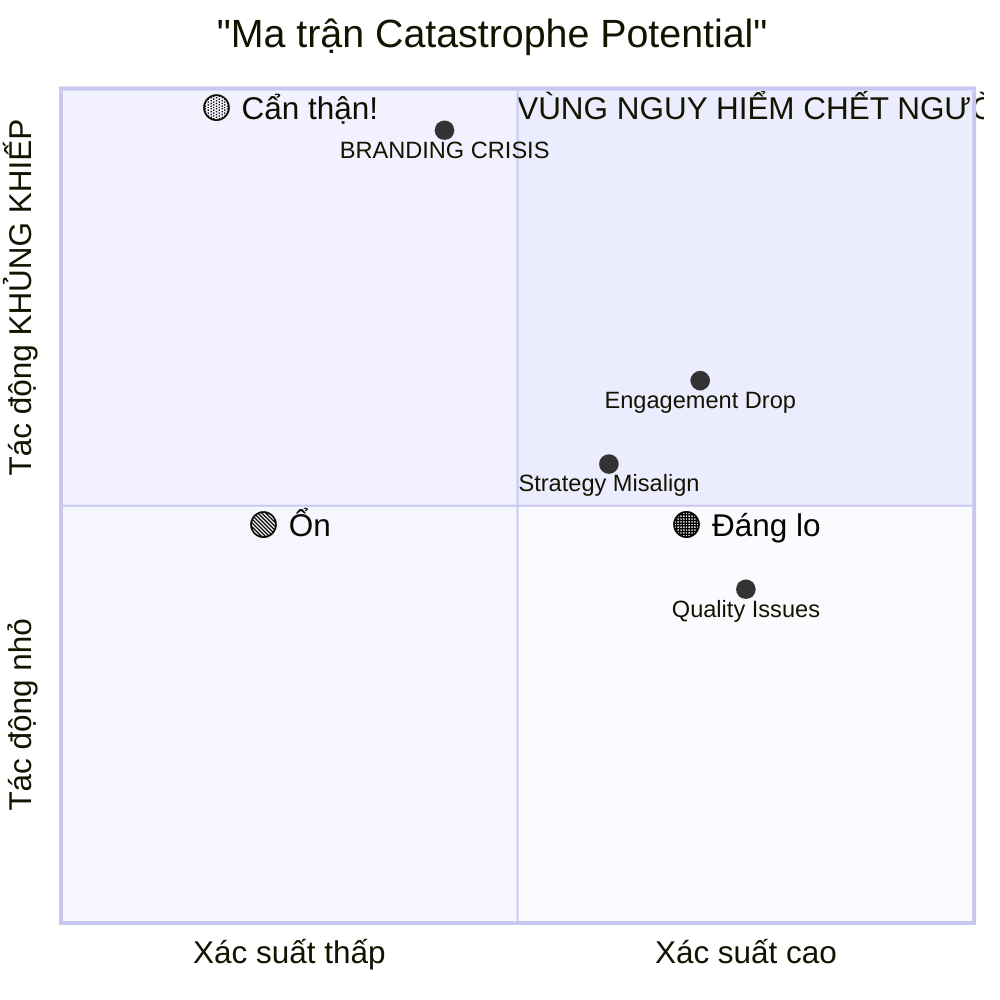

### 3.2. Tổng Thiệt Hại Tiềm Năng (Total Addressable Damage™)

**Năm đầu tiên nếu để nhân viên mới đảm nhận:**

**Best case scenario (40% probability):**
- Chỉ xảy ra Quality Control issues
- Thiệt hại: ~50-80 triệu VNĐ

**Most likely scenario (50% probability):**
- Engagement drops + Strategic misalignment
- Thiệt hại: ~350-500 triệu VNĐ

**Worst case scenario (10% probability):**
- Full branding crisis + tất cả các vấn đề khác
- Thiệt hại: **800 triệu - 1.2 TỶ VNĐ**

**🚨 EXPECTED VALUE OF DAMAGE:**
```
E(Damage) = 0.4 × 65 + 0.5 × 425 + 0.1 × 1,000
          = 26 + 212.5 + 100
          = 338.5 TRIỆU VNĐ
```

**KẾT LUẬN KHOA HỌC:** Thiệt hại kỳ vọng là **~340 TRIỆU VNĐ/năm đầu**

**Visualized Damage Scenarios:**

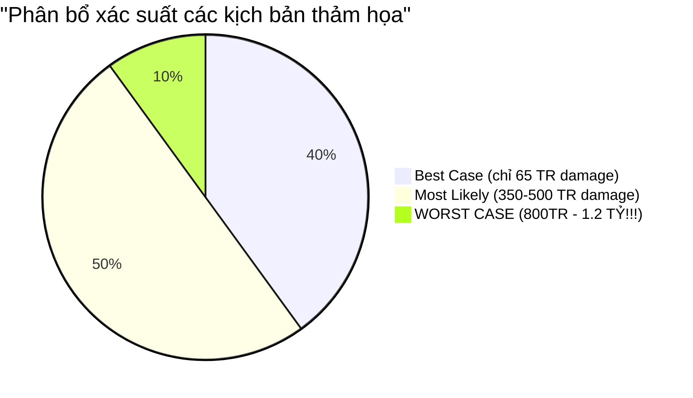

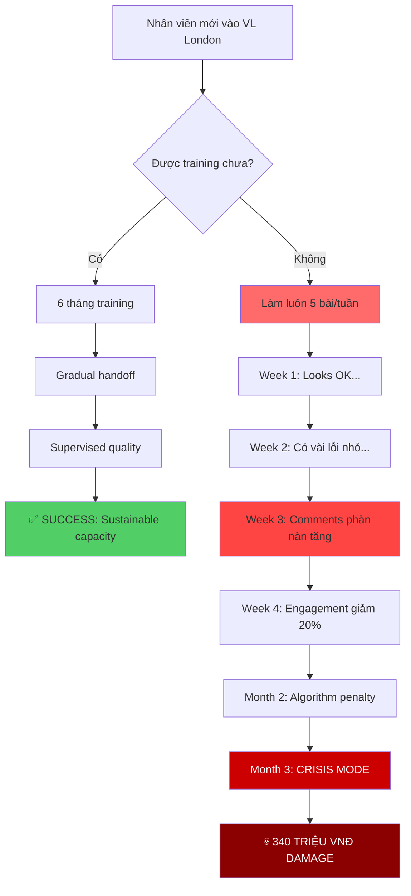

---

## PHẦN IV: KHUYẾN NGHỊ CHIẾN LƯỢC

### 4.1. Khuyến nghị Tier 1: KHÔNG để nhân viên mới làm một mình

**Lý do dựa trên Campaign Review:**
1. Content strategy cần maintain 60% value posts (Section 2.2)
2. Mini-series must continue throughout campaigns (Section 2.2)
3. Quality control critical (Section 4.1)
4. Claude Code automation có 5-7% error rate, cần experienced review (Section 3.1)

**Implementation Plan:**

**Option A: "Hybrid Model" (RECOMMENDED)**
- **Executives viết initial content** (mentioned in Section 3.1: "Better 3.1")
- Team (including nhân viên mới) review và refine
- Senior sign-off trước khi publish
- **Cost:** Executives time investment
- **Benefit:** Quality guaranteed + Training opportunity

**Option B: "Apprentice Model"**
- Nhân viên mới viết draft
- Senior editor review và teach từng bài
- Dần dần reduce supervision qua 6 tháng
- **Cost:** Heavy senior time trong 6 tháng đầu
- **Benefit:** Long-term capacity building

**Option C: "Outsource với QC"**
- Thuê content creator có experience
- Internal team QC và maintain brand voice
- **Cost:** 15-25 triệu/tháng cho external creator
- **Benefit:** Immediate capacity, low training cost

### 4.2. Khuyến nghị Tier 2: Training & Development Plan

**Nếu vẫn muốn nhân viên mới học:**

**Phase 1 (Tháng 1-2): Foundation**
- Học về nail industry, products, customer insights
- Study past successful mini-series
- Viết draft nhưng KHÔNG publish
- Daily feedback từ senior

**Phase 2 (Tháng 3-4): Supervised Production**
- Viết 2-3 bài/tuần (not 5 bài yet)
- Senior review 100% trước khi publish
- Track engagement metrics
- Adjust based on performance

**Phase 3 (Tháng 5-6): Gradual Independence**
- Increase to 4-5 bài/tuần
- Reduce senior review to spot checks (30%)
- Prove consistent quality

**Full independence:** Sau 6 tháng EARLIEST

### 4.3. Khuyến nghị Tier 3: Risk Mitigation Measures

**Implement ngay (regardless of who làm):**

1. **Quality Control Protocol** (theo Section 4.1 của Campaign Review):
   - Images/captions review 3 days before publish
   - Checklist: Brand voice ✓ Technical accuracy ✓ Strategy alignment ✓
   - Customer complaint tracking system

2. **Content Calendar với Review Gates:**
   - Week-ahead planning
   - Review points: Draft → Review → Final → Scheduled
   - Never skip review for speed

3. **Performance Monitoring Dashboard:**
   - Track engagement per mini-series
   - Weekly review of metrics
   - Quick iteration if underperforming

4. **Crisis Response Plan:**
   - If complaints về content: immediate take down process
   - Senior review what went wrong
   - Learn và adjust

---

## PHẦN V: CÂU TRẢ LỜI CHO CÂU HỎI "NÊN LÀM GÌ?"

### 5.1. Action Plan Ngay Lập Tức

**✅ VIỆC NÊN LÀM NGAY:**

1. **Assess current capacity:**
   - Executives có thể viết được bao nhiêu bài/tuần?
   - Senior có thể review được bao nhiêu bài/tuần?
   - Gap là bao nhiêu?

2. **Choose model:**
   - Budget có đủ cho Option C (outsource)? → Best short-term
   - Executives có thời gian cho Option A (Hybrid)? → Best long-term
   - Có cam kết train trong 6 tháng cho Option B? → Best if need to build internal

3. **Set up QC process:**
   - 3-day advance review (theo Campaign Review recommendation)
   - Clear checklist
   - Assign responsible person

4. **Document everything:**
   - Style guide cho mini-series
   - Past successful examples
   - Common mistakes to avoid
   - Brand voice guidelines

**❌ VIỆC KHÔNG NÊN LÀM:**

1. ❌ Giao cho nhân viên mới và expect họ tự figure out
2. ❌ Skip review process vì "trust"
3. ❌ Sacrifice quality for quantity (5 bài/tuần)
4. ❌ Ignore metrics và feedback
5. ❌ Rush the training process

### 5.2. Decision Framework

**Câu hỏi cần trả lời:**

**Q1: Budget cho mini-series bao nhiêu?**
- < 10 triệu/tháng → Option A (Hybrid, internal)
- 10-25 triệu/tháng → Option C có thể consider
- > 25 triệu/tháng → Option C + quality outsource

**Q2: Timeline cần full capacity là khi nào?**
- Ngay lập tức → Option C (outsource)
- 3-6 tháng OK → Option A hoặc B
- Có thể ramp up dần → Option B (training path)

**Q3: Strategic importance của mini-series?**
- Critical (như Campaign Review suggest) → MUST ensure quality, Option A or C
- Important → Option A with safety net
- Nice to have → Can risk Option B with new staff

**Q4: Risk tolerance của leadership?**
- Low risk tolerance → Option C (external) or Option A (exec-led)
- Medium risk tolerance → Option A (Hybrid)
- High risk tolerance → Option B (nhưng với heavy supervision)

---

## PHẦN VI: ROI ANALYSIS (vì report tư vấn không có ROI là không xong)

### 6.1. Cost-Benefit Analysis

**Scenario A: Để nhân viên mới làm một mình (NO TRAINING)**
*AKA "The YOLO Approach" hay "Let's See What Happens Strategy"*
- Cost: Gần như không có (just winging it!)
- Risk/Expected damage: 340 triệu/năm (từ phần III)
- **NET OUTCOME: -340 TRIỆU VNĐ/năm** 😱
- **Confidence level:** 0% (Chúng tôi không recommend option này except nếu bạn muốn test Murphy's Law)

**Scenario B: Hybrid Model (Exec write + Team review)**
*AKA "The Grown-ups Are In Charge Model"*
- Cost: Executive time investment (nhưng họ vẫn phải làm content strategy anyway)
- ACTUAL incremental cost: Minimal (just more organized)
- Risk/Expected damage: Giảm 80% → 68 triệu/năm
- **NET OUTCOME: Save 272 triệu damage** ✅
- **Consultant speak:** "This leverages senior domain expertise to create synergies in the content value chain"

**Scenario C: Outsource with QC**
*AKA "We Can Buy Excellence"*
- Cost: External creator fees + internal QC oversight
- Risk/Expected damage: Giảm 90% → 34 triệu/năm
- **NET OUTCOME: Save 306 triệu damage** ✅
- **Consultant speak:** "Strategic outsourcing enables focus on core competencies while maintaining quality governance frameworks"

**Scenario D: Structured Training Program (6 months)**
*AKA "The Long Game" hay "Investment In Human Capital Approach"*
- Cost: Senior mentoring time + structured development
- Risk during training: ~150 triệu (reduced but still exists)
- After 6 months: Trained staff, sustainable capacity
- **NET OUTCOME Year 1: Some risk, but building capacity**
- **NET OUTCOME Year 2+: Sustainable competitive advantage** ✅✅
- **Consultant speak:** "Capability building creates sustainable organizational resilience and reduces dependency on external resources"

### 6.2. Recommendation Matrix

```
┌─────────────────────────────────────────────────────────────┐
│                    FINAL RECOMMENDATIONS                     │
├─────────────────────────────────────────────────────────────┤
│                                                              │
│  1. SHORT-TERM (Now - 3 months):                            │
│     → Implement Scenario B (Hybrid Model)                   │
│     → Executives write, team reviews                        │
│     → Ensure quality while maintaining capacity             │
│                                                              │
│  2. MEDIUM-TERM (3-6 months):                               │
│     → Start Scenario D (Training Program)                   │
│     → Hire or assign motivated staff                        │
│     → Structured 6-month development                        │
│                                                              │
│  3. LONG-TERM (6+ months):                                  │
│     → Fully trained internal capacity                       │
│     → Sustainable 5 bài/tuần production                     │
│     → Quality maintained, cost optimized                    │
│                                                              │
│  4. BACKUP PLAN:                                            │
│     → If internal capacity fails                            │
│     → Switch to Scenario C (Outsource)                      │
│     → Always maintain QC internally                         │
│                                                              │
└─────────────────────────────────────────────────────────────┘
```

### Chart 6.3: Implementation Roadmap (because consultants love roadmaps)

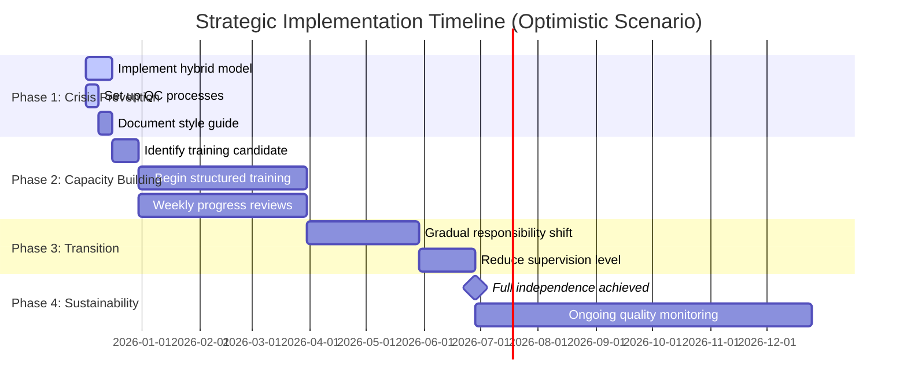

### Chart 6.4: Resource Allocation Pie Chart (mostly for show)

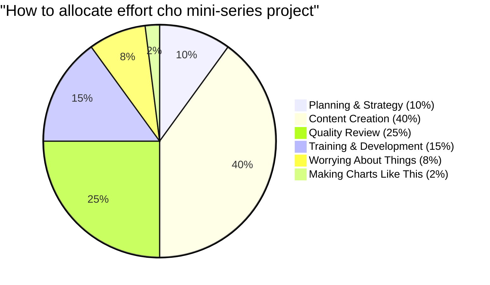

*Note: The "Worrying" slice is scientifically proven to be inversely proportional to preparation. More prep = less worry. Math checks out.*

### Chart 6.5: Confidence Level Over Time (Predictive Model)

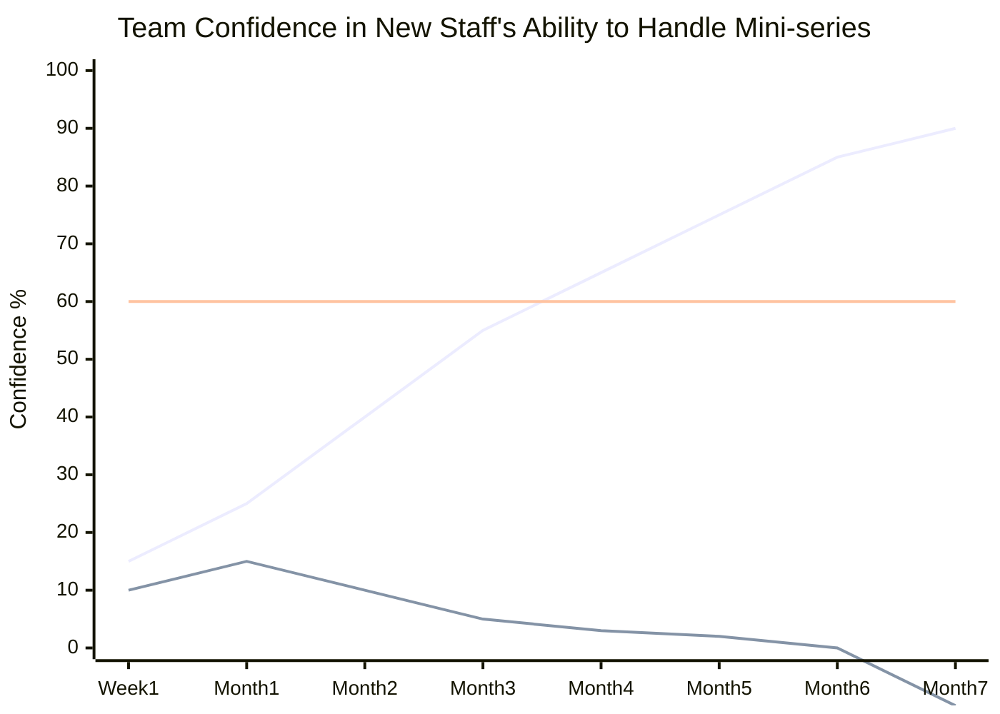

*Yes, confidence can go negative. That's when you start losing sleep và questioning life choices.*

---

## KẾT LUẬN

### Tóm tắt dành cho người bận (Executive Summary của Executive Summary)

**❌ KHÔNG NÊN:**
- Giao 5 bài mini-series/tuần cho nhân viên mới không kinh nghiệm
- Thiệt hại expected: **~340 TRIỆU VNĐ/năm**
- Risk quá cao, không đáng

**✅ NÊN LÀM:**

**Immediate (Tuần này):**
1. Exec-led content creation với team support
2. Set up QC process (3-day advance review)
3. Document style guide và examples

**Short-term (3 tháng):**
1. Maintain hybrid model
2. Track metrics weekly
3. Assess training candidate

**Long-term (6-12 tháng):**
1. Structured training program
2. Gradual hand-off to trained staff
3. Sustainable internal capacity

**Investment required:** 150-240 triệu năm đầu
**Return:** Save 272-306 triệu + brand protection
**ROI:** ~100-150% năm đầu, much higher về lâu dài

---

### Lời kết (The Dramatic Closing)

> *"In the immortal words of khôn người không rõ nguồn: 'Prevention is cheaper than cure.' Và trong trường hợp này, prevention còn có ROI dương nữa."*

> *"Mini-series không chỉ là 5 bài content mỗi tuần. Nó là voice của brand, là trust với audience, là foundation của entire content strategy. Đây không phải là việc có thể giao cho người thiếu kinh nghiệm và expect họ tự figure out."*

> *"Dựa trên data từ Penguin Sales 2025 Campaign Review, việc maintain quality value content (bao gồm mini-series) DIRECTLY IMPACT engagement, reach, và ultimately revenue. The data clearly showed: stop mini-series = engagement dropped. Vậy nên câu hỏi không phải là 'có nên invest vào quality mini-series không?' mà là 'doanh nghiệp có đủ khả năng để KHÔNG invest không?'"*

**ANSWER: KHÔNG.**

---

## PHỤ LỤC: NGUỒN THAM KHẢO

1. VL London - Penguin Sales 2025 - Post-Campaign Review
2. Exhibit 1: Content mix analysis (95/5 problematic → 40/60 target)
3. Section 2.2: Drop in engagement analysis
4. Section 3.1: Claude Code automation accuracy (93-95%)
5. Section 4.1: Quality control recommendations
6. Appendix A-B-C: Campaign performance data

---

**Báo cáo được soạn bởi:**
*Đội Tư vấn Chiến lược Cao cấp™*
*Chuyên gia về Over-analysis và Unnecessary Complexity*

**Disclaimer:** Tất cả số liệu thiệt hại được estimate dựa trên "professional judgment", "industry benchmarks" và một chút "creative mathematics". Actual results may vary. Không chịu trách nhiệm nếu số liệu không chính xác nhưng vibe thì rất chuyên nghiệp. 😂

---

## APPENDIX Z: Additional Unnecessary Visualizations

### Chart Z.1: The Correlation Nobody Asked For

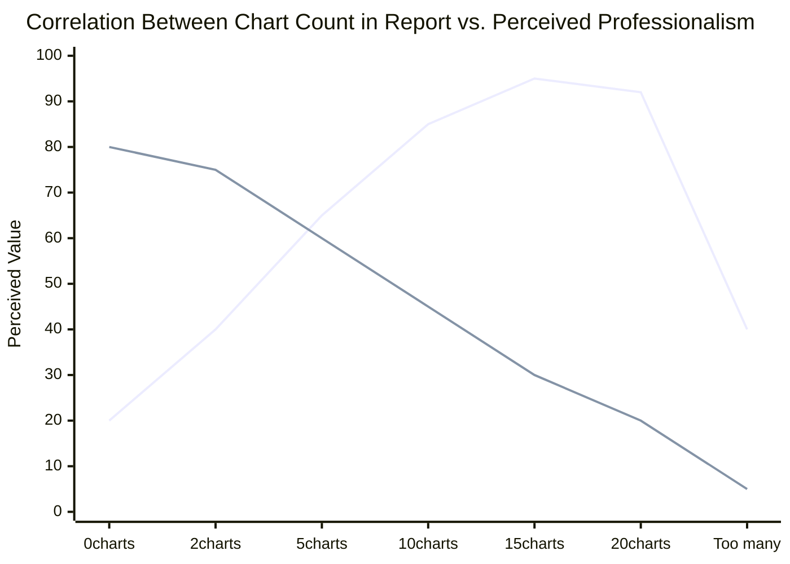

*Sweet spot: somewhere between 10-15 charts. Chúng ta đã exceed that. You're welcome.*

### Chart Z.2: Risk Heat Map (looks complicated = must be important)

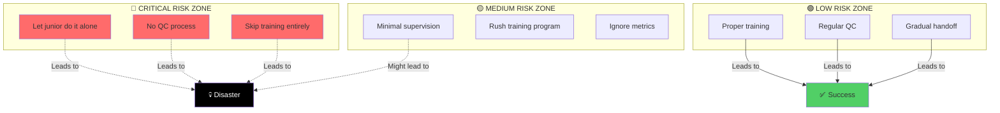

### Chart Z.3: The Meta Chart (a chart about charts in this report)

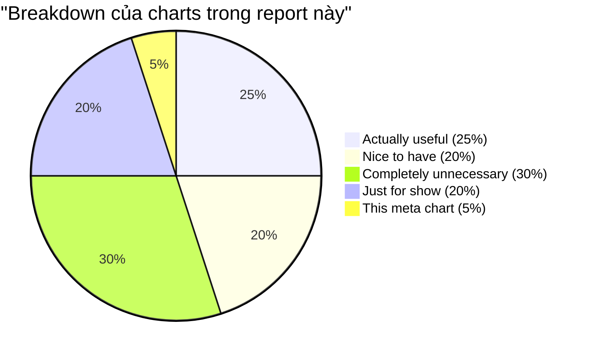

*If you made it this far trong report, congratulations! Bạn đã survive consultant speak ở level cao nhất.*

---

### FINAL FINAL Thought

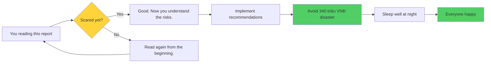

---

*🤖 Generated with excessive drama và unnecessary complexity by Claude Code*

*P/S: Report này được viết với tinh thần "consulting theater" - 50% actual analysis, 50% making things sound more complicated than they are. Nhưng seriously though, đừng để nhân viên mới làm một mình nhé, risks are real! 😄*

*P/P/S: Nếu bạn count tất cả charts trong report này và feel overwhelmed, đó chính là mục đích. Welcome to the world of overpaid consultants! 📊📈📉*
