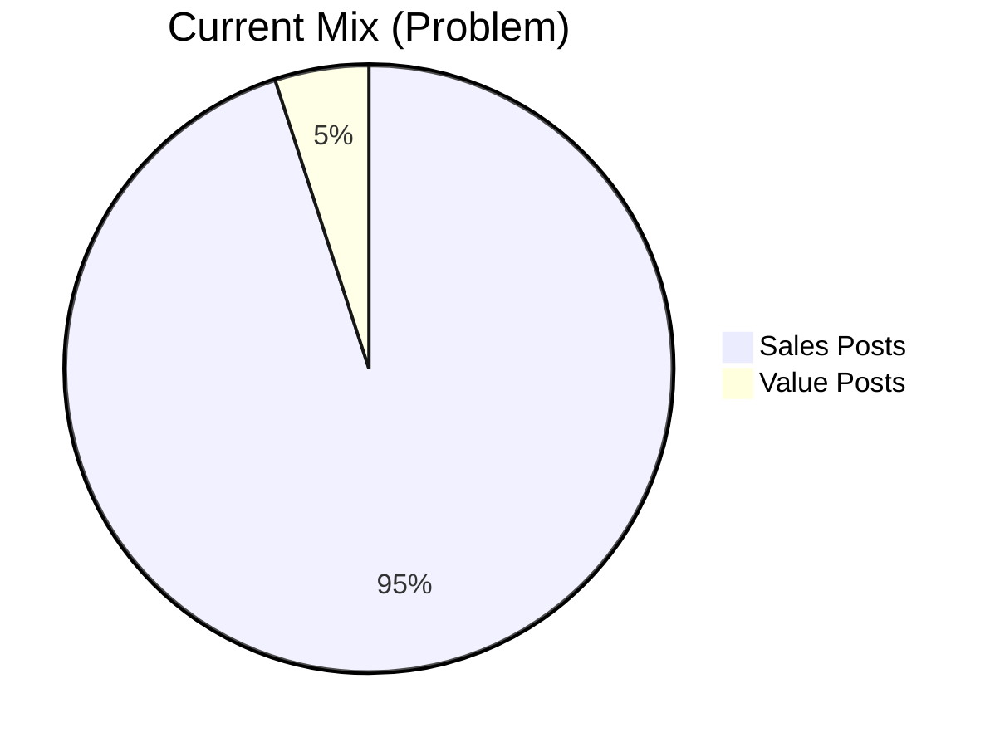
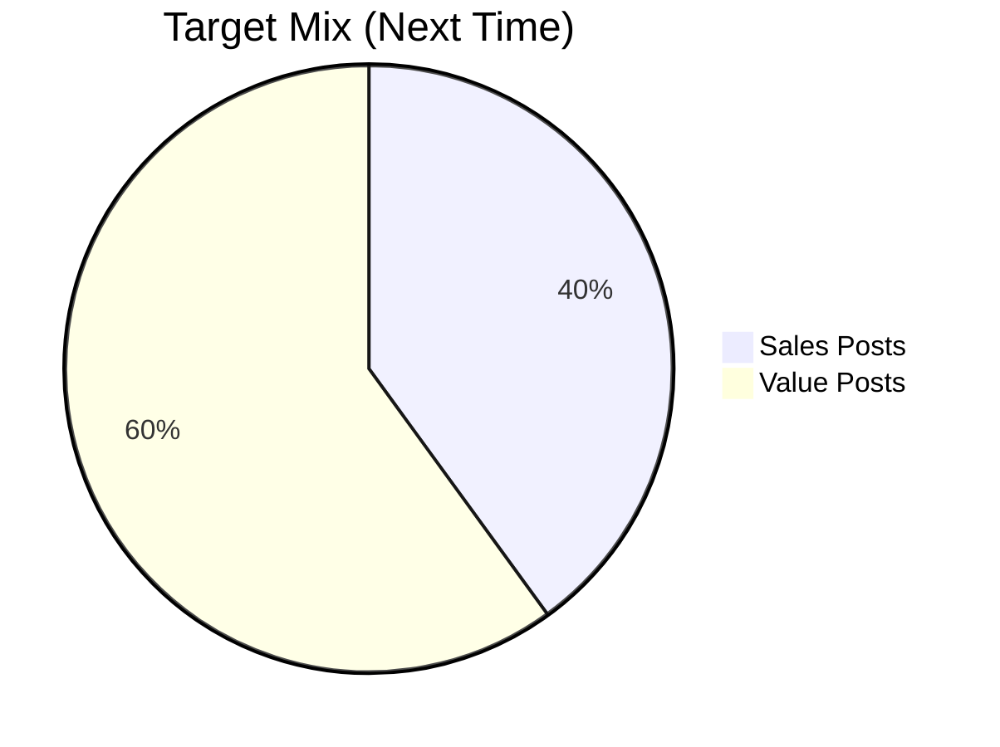
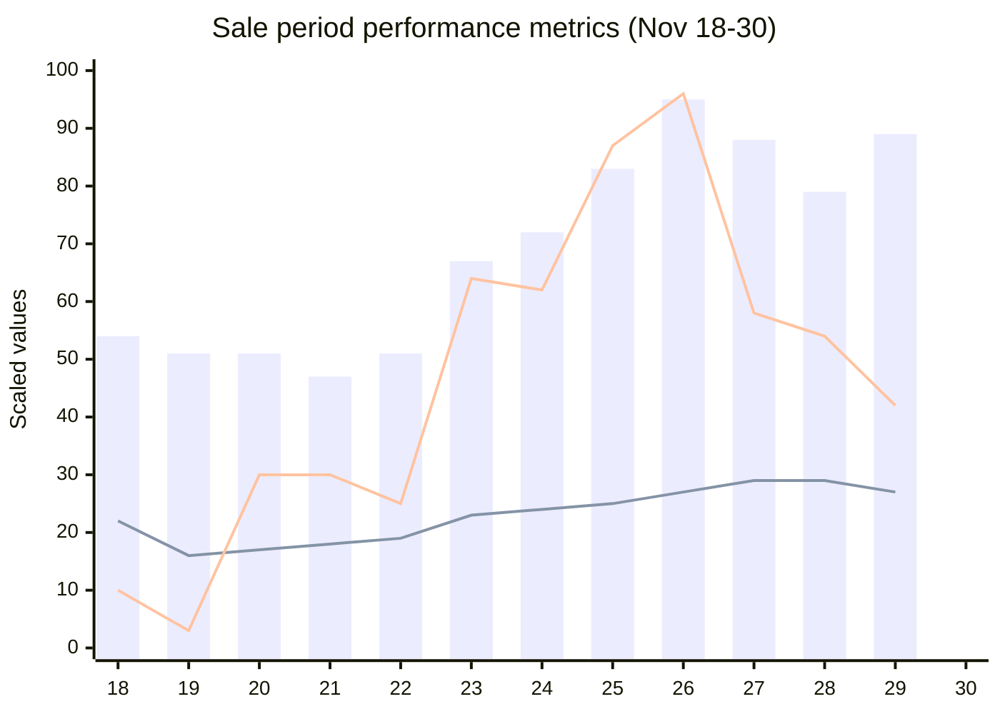
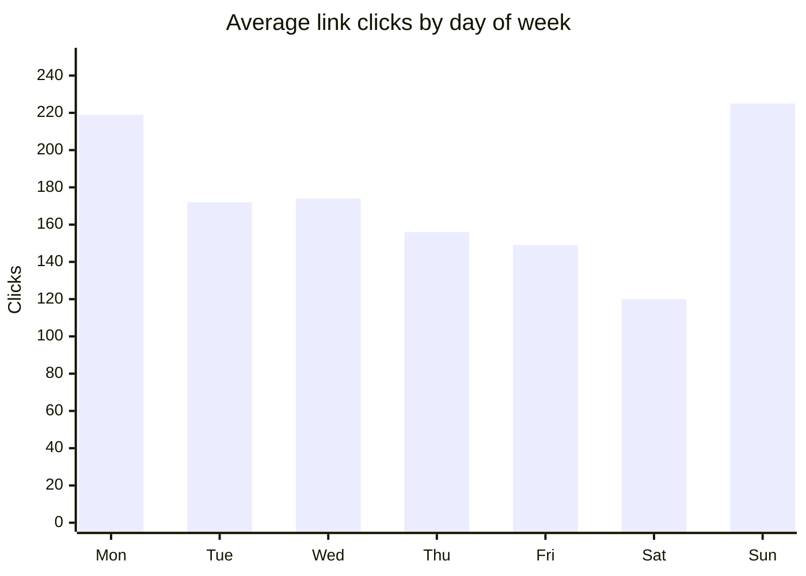

# VL London - Penguin Sales 2025 - Đánh Giá Sau Chiến Dịch

**Tóm tắt:**

Chiến dịch Penguin Sales 2025 đạt được sự thực thi tốt thông qua công nghệ và nội dung với khối lượng lớn. Hệ thống HTML tự động và chú thích Claude Code (độ chính xác 93-95%) cho phép đăng 100 bài mỗi tuần. Thực thi chiến dịch tốt với chuẩn bị kỹ hơn, trang trí cửa hàng, hiệu suất quảng cáo hiệu quả, và đỉnh điểm tương tác từ hoạt động livestream vào ngày cuối cùng.

Thách thức chính là phối hợp liên phòng ban: bảng giá chỉ nhận được 1 tuần trước khi ra mắt đòi hỏi phải tạo lại hoàn toàn tài liệu, thay đổi chiến lược vào phút chót gây tốn kém khi in lại, sản phẩm mới ra mắt mà không thông báo trước, và lỗi hệ thống từ việc thực hiện vội vàng dẫn đến khiếu nại của khách hàng. Chiến lược nội dung cũng gặp vấn đề với tỷ lệ 95% bán hàng / 5% giá trị gây giảm tương tác. Khắc phục: thiết lập quy trình thông báo trước 2 tuần cho bảng giá và chiến lược, triển khai quy trình kiểm soát chất lượng với thời gian chuẩn bị 3 ngày, thay đổi tỷ lệ nội dung thành 40% bán hàng / 60% giá trị duy trì mini-series, và tối ưu hóa thiết lập kỹ thuật livestream.

## Mục lục

**Chủ đề 1: Livestream & hoạt động**
- **Tốt 1.1:** Livestream & hoạt động - Quay số trúng thưởng tạo đỉnh điểm tương tác ngày cuối
- **Cải thiện 1.1:** Nâng cao hoạt động - Nhiều phiên livestream với giải thưởng phân tầng
- **Vấn đề 1.2:** Chất lượng livestream - Vấn đề âm thanh ảnh hưởng chất lượng
- **Khắc phục 1.2:** Tối ưu hóa kỹ thuật - Tối ưu thiết lập và tỷ lệ 50/50 demo/giới thiệu sản phẩm

**Chủ đề 2: Thực thi chiến dịch & chiến lược nội dung**
- **Tốt 2.1:** Thực thi chiến dịch - Hiệu suất tốt với 833k lượt xem và tăng trưởng +54% (Phụ lục A-B-C)
- **Cải thiện 2.1:** Mở rộng thực thi chiến dịch - Ghi chép quy trình và mở rộng đăng bài chiến lược
- **Vấn đề 2.2:** Sụt giảm chiến lược nội dung - Tỷ lệ 95% bán hàng / 5% giá trị làm giảm tương tác (Bảng 1)
- **Khắc phục 2.2:** Cân bằng chiến lược nội dung - Mục tiêu 40% bán hàng / 60% giá trị với mini-series

**Chủ đề 3: Công nghệ & tự động hóa**
- **Tốt 3.1:** Hệ thống công nghệ & tự động hóa - HTML tự động và Claude Code cải thiện tốc độ sản xuất đáng kể
- **Cải thiện 3.1:** Nâng cao quy trình nội dung - Chuyển sang cấp quản lý viết với nhóm đánh giá

**Chủ đề 4: Phối hợp liên phòng ban**
- **Vấn đề 4.1:** Phối hợp liên phòng ban & thời gian - Thời gian chuẩn bị không đủ gây chậm trễ bảng giá và vấn đề chất lượng (Bảng 2)
- **Khắc phục 4.1:** Giao tiếp & quy trình chất lượng - Thiết lập thông báo trước 2 tuần và quy trình kiểm soát chất lượng

**Phụ lục**
- Phụ lục A: Dữ liệu Facebook insights hàng ngày (18-30 tháng 11, 2025)
- Phụ lục B: Trực quan hóa hiệu suất
- Phụ lục C: Chỉ số hiệu suất chính & nhận định

## Chủ đề 1: Livestream & hoạt động

### Good 1.1. Hoạt động livestream & quay số trúng thưởng
Hoạt động livestream và quay số trúng thưởng tăng cường tương tác con người và tạo bầu không khí bán hàng mạnh mẽ. Đỉnh điểm tương tác xảy ra vào ngày cuối cùng với nhiều khách hàng tham gia và mua hàng.

**Better: Nâng cao hoạt động tương tác**

- Lên lịch nhiều phiên livestream trong suốt thời gian sale để duy trì động lực tương tác
- Giới thiệu giải thưởng quay số phân tầng để khuyến khích tham gia sớm hơn
- Quảng bá lịch livestream trước để tạo sự mong đợi

### Vấn đề 1.2. Chất lượng livestream
Livestream có vấn đề về âm thanh ảnh hưởng đến chất lượng.

**Khắc phục: Tối ưu hóa kỹ thuật**

- **Kỹ thuật:** Thi và Cong thảo luận tối ưu hóa để giảm thiểu lỗi

- **Định dạng nội dung:**
  - Khán giả thích giới thiệu sản phẩm hơn talkshow với thợ nail
  - Tỷ lệ mục tiêu: 50% demo (có thể thảo luận vấn đề salon trong demo, không tách thành 2 phân đoạn) + 50% giới thiệu sản phẩm (Viet)
  - Cân nhắc định dạng đóng đơn hàng livestream - sở thích khán giả dựa trên 2 livestream và bình luận
  - Yêu cầu sự tham gia của nhóm bán hàng để thực hiện

## Chủ đề 2: Thực thi chiến dịch & chiến lược nội dung

### Tốt 2.1. Thực thi chiến dịch
Nhóm đã đạt và vượt mục tiêu bài đăng ban đầu với nội dung bổ sung để thúc đẩy doanh số và tăng tương tác. Chuẩn bị tốt hơn và sớm hơn so với những năm trước, bao gồm poster in và trang trí cửa hàng cho đợt sale. Hệ thống tự động hóa cho phép khoảng 100 bài đăng mỗi tuần. Nhờ chuẩn bị sớm các hoạt động "phải có", nhóm có thời gian cho các hoạt động "nên có" như livestream và quay số trúng thưởng. Đăng sản phẩm chiến lược với kế hoạch cụ thể giúp thúc đẩy sản phẩm mục tiêu, nhiều sản phẩm bán nhiều hơn hoặc hết hàng hoàn toàn. Một số bài đăng có liên kết myVL.

Chiến dịch quảng cáo mang lại kết quả tốt, thành công trong việc thúc đẩy sản phẩm mục tiêu và sản phẩm khách hàng yêu cầu. Nội dung hình ảnh đẹp bù đắp cho việc thiếu theo dõi quảng cáo. Cong phát hiện và dừng quảng cáo tần suất cao cho chiến dịch chỉ London kịp thời.

Dữ liệu hiệu suất chiến dịch cho thấy kết quả tốt với tăng trưởng bền vững trong suốt giai đoạn 2 tuần. Tổng охват đạt **833,100 lượt xem** và **282,482 người xem duy nhất**, với tích hợp liên kết myVL tạo ra **1,986 click link**. So sánh tuần qua tuần cho thấy động lực tích lũy: Tuần 2 cho thấy **tăng trưởng +54% lượt xem**, **tăng trưởng +37% người xem**, và **tăng trưởng +110% click link** so với Tuần 1. Hiệu suất đỉnh điểm xảy ra vào 26-27 tháng 11 với **95,830 lượt xem** và **339 click link** trong một ngày, trùng với hoạt động livestream và quay số trúng thưởng (xem Phụ lục A và B để biết dữ liệu chi tiết và trực quan hóa).

**Cải thiện: Mở rộng thực thi chiến dịch**

- Ghi chép và hệ thống hóa quy trình chuẩn bị sớm để nhân rộng thành công một cách nhất quán
- Mở rộng cách tiếp cận đăng sản phẩm chiến lược sang nhiều danh mục sản phẩm hơn
- Phát triển quy trình giám sát quảng cáo để phát hiện vấn đề tần suất cao sớm hơn
- Tăng tích hợp liên kết myVL trên nhiều bài đăng hơn

### Vấn đề 2.2. Chiến lược nội dung - sụt giảm tương tác
Sự sụt giảm đáng chú ý trong tương tác xảy ra trong thời gian sale. Sự kết hợp nội dung trở nên nghiêng nặng về bài đăng bán hàng (95%) với nội dung giá trị chỉ còn 5%. Nhóm ngừng sản xuất nội dung mini-series, vốn trước đây mang lại giá trị đáng kể cho khán giả. Sự mất cân bằng này có nghĩa là người theo dõi bị tấn công bởi thông điệp bán hàng mà không có nội dung giá trị hỗ trợ để xây dựng lòng tin và tương tác. Dữ liệu rõ ràng cho thấy đây là một sai lầm - các chỉ số tương tác giảm khi nội dung giá trị biến mất.

Ngoài ra, không đủ video được sản xuất lần này, hạn chế sự đa dạng nội dung và cơ hội tương tác.

**Bảng 1: Phân tích kết hợp nội dung**

**Khắc phục: Cân bằng chiến lược nội dung**

- Mục tiêu kết hợp nội dung: 40% bài đăng bán hàng và 60% bài đăng giá trị (đảo ngược hoàn toàn tỷ lệ 95/5 có vấn đề)
- Nội dung mini-series phải tiếp tục chạy trong suốt thời gian sale - không được ngừng
- Nội dung giá trị hỗ trợ và mang bán hàng bằng cách duy trì tương tác và lòng tin của khán giả
- Khi yêu cầu về thời gian được đẩy nhanh, phân bổ nhiều thời gian hơn cho sản xuất video để giải quyết khoảng trống đa dạng nội dung

## Chủ đề 3: Công nghệ & tự động hóa

### Tốt 3.1. Hệ thống công nghệ & tự động hóa
Hệ thống HTML tự động mới là một thành công lớn cho mùa sale này. Hệ thống giảm đáng kể thời gian cần thiết để tạo tài liệu marketing bằng cách cho phép nhóm chỉ cần đưa vào hình ảnh và giá cả, sau đó được tự động xử lý thành đầu ra HTML. Điều này tạo ra một nguồn sự thật duy nhất cho bảng giá trên tất cả tài liệu, loại bỏ sự không nhất quán từng gây ra vấn đề cho các chiến dịch trước. Cải thiện tốc độ có nghĩa là nhóm có thể sản xuất hình ảnh bán hàng cho chiến dịch marketing cực kỳ nhanh, giải phóng thời gian cho công việc chiến lược hơn.

Claude Code cho viết chú thích chứng minh hiệu quả cao, đạt độ chính xác 93-95% với chỉ 5-7% tỷ lệ lỗi. Tự động hóa này cho phép nhóm duy trì khối lượng đầu ra cao 70+ bài đăng mỗi tuần, điều khó duy trì với viết thủ công. Thời gian tiết kiệm từ viết cho phép nhóm tập trung nhiều hơn vào phân phối nội dung và chiến lược.

**Cải thiện: Nâng cao quy trình nội dung**

- Chuyển sang cấp quản lý viết chú thích ban đầu, với nhóm đánh giá và tinh chỉnh
- Duy trì khối lượng cao 70+ bài đăng mỗi tuần hiệu quả hơn
- Tận dụng thành công tự động hóa trong khi thêm giám sát chiến lược

## Chủ đề 4: Phối hợp liên phòng ban

### Vấn đề 4.1. Phối hợp liên phòng ban & thời gian
Vấn đề quan trọng nhất mùa này là thời gian chuẩn bị và giao tiếp giữa các phòng ban không đầy đủ, biểu hiện qua bốn lĩnh vực quan trọng:

**Thời gian bảng giá:** Nhóm chỉ nhận được giá chiết khấu cuối cùng một tuần trước khi ra mắt. Tài liệu marketing phải được tạo trong Tuần -2 dựa trên bảng giá từ mùa sale trước. Khi giá thực tế đến trong Tuần -1, cấu trúc giá và nhóm mặt hàng hoàn toàn khác với kỳ vọng. Nhóm phải tạo lại tất cả tài liệu trong Tuần -1, nhưng với thời gian không đủ để thích ứng đúng cách. Đợt sale ra mắt với tài liệu marketing không hoàn toàn khớp với giá thực tế.

**Ra mắt sản phẩm vào phút chót:** Một số sản phẩm mới ra mắt vào ngày sale và cần được đăng ngay lập tức. Marketing có công việc bất ngờ mà không có thời gian chuẩn bị đúng. Trong khi bài đăng khẩn cấp có thể làm được, chúng sẽ không có chất lượng hoàn hảo.

**Thay đổi chiến lược:** Chiến lược sale hoàn thiện gần ngày sale, gây thay đổi kế hoạch đã chuẩn bị trước. Ví dụ: Poster đã in rồi, sau đó chương trình thay đổi, yêu cầu in lại tốn kém.

**Tính đầy đủ của file giá:** Hệ thống phụ thuộc vào file giá đầy đủ từ Bang. Không thể giả định "mọi người đều biết" - sản phẩm không có trong file dẫn đến không có hình ảnh và không có bài đăng cho những sản phẩm đó.

**Lỗi hệ thống:** Hình ảnh và chú thích được sản xuất nhanh thông qua tự động hóa, nhưng vẫn có lỗi dẫn đến một số khiếu nại của khách hàng. Quy trình kiểm soát chất lượng cần củng cố.

**Bảng 2: So sánh thời gian**

**Điều lẽ ra phải xảy ra:**

<table>
<tr><th width="400">Nhiệm vụ</th><th width="80">Tuần -2</th><th width="80">Tuần -1</th><th width="80">Tuần 0</th><th width="80">Tuần 1</th><th width="80">Tuần 2</th></tr>
<tr><td>1.1 Nhận giá cuối cùng</td><td>████</td><td></td><td></td><td></td><td></td></tr>
<tr><td>1.2 Tạo/sửa tài liệu với giá cuối cùng</td><td></td><td>████</td><td></td><td></td><td></td></tr>
<tr><td>2.1 Ra mắt sale</td><td></td><td></td><td>LAUNCH</td><td></td><td></td></tr>
<tr><td>2.2 Bán hàng</td><td></td><td></td><td></td><td>████</td><td>████</td></tr>
</table>

**Điều thực sự xảy ra:**

<table>
<tr><th width="400">Nhiệm vụ</th><th width="80">Tuần -2</th><th width="80">Tuần -1</th><th width="80">Tuần 0</th><th width="80">Tuần 1</th><th width="80">Tuần 2</th></tr>
<tr><td>1.1 Tạo tài liệu dựa trên giá sale trước</td><td>████</td><td></td><td></td><td></td><td></td></tr>
<tr><td>1.2 Nhận giá - cấu trúc nhóm hoàn toàn khác</td><td></td><td>████</td><td></td><td></td><td></td></tr>
<tr><td>1.3 Tạo lại tất cả tài liệu</td><td></td><td>████</td><td></td><td></td><td></td></tr>
<tr><td>2.1 Ra mắt sale (tài liệu không khớp)</td><td></td><td></td><td>LAUNCH</td><td></td><td></td></tr>
<tr><td>2.2 Bán hàng</td><td></td><td></td><td></td><td>████</td><td>████</td></tr>
</table>

**Khắc phục: Thiết lập giao tiếp rõ ràng & quy trình chất lượng**

- **Thời gian bảng giá:** Nhận bảng giá cuối cùng vào Tuần -2 hoặc sớm hơn để tạo tài liệu marketing chính xác ngay từ đầu thay vì lãng phí thời gian làm lại hoàn toàn. Kế hoạch tốt hơn với nhiều thời gian chuẩn bị hơn ngăn ngừa tình huống vội vàng, áp lực cao.

- **Yêu cầu thông báo trước:** Thời gian và chiến lược sale phải thông báo Marketing trước 2 tuần. Có thể thông báo nhóm bán hàng sau, nhưng Marketing cần thông tin cơ bản: thời gian, chi tiết chương trình sale (giảm thêm 10%...?). File giá phải được hoàn thiện ít nhất 1 tuần trước và gửi cho Marketing.

- **Phối hợp ra mắt sản phẩm:** Thông báo trước cho Marketing về ra mắt sản phẩm mới để có thời gian chuẩn bị ảnh và bài đăng.

- **File giá đầy đủ:** File giá phải bao gồm tất cả sản phẩm với thông tin đầy đủ được viết rõ ràng. Không giả định về "mọi người đều biết" - cần охват đầy đủ cho tất cả sản phẩm sale.

- **Quy trình kiểm soát chất lượng:** Hệ thống hình ảnh và chú thích - khi chỉnh sửa, nên là cuối cùng và hoàn thành không còn lỗi. Hình ảnh có thể bắt đầu 3 ngày trước khi ra mắt (thời gian thực tế vì giá phụ thuộc vào Bang). Chú thích phụ thuộc vào hình ảnh nào sẽ được tải lên (bao gồm hình ảnh bổ sung yêu cầu mô tả). Hình ảnh và chú thích có thể linh hoạt bắt đầu 3 ngày trước, nhưng phải chính xác - giảm thiểu vội vàng và lỗi.

---

## Phụ lục A: Dữ liệu Facebook insights hàng ngày (18-30 tháng 11, 2025)

| Ngày | Lượt xem | Người xem | Click link | Tương tác | Lượt truy cập trang | Người theo dõi mới |
|------|------:|--------:|------------:|-------------:|------------:|------------:|
| Nov 18 | 54,526 | 22,232 | 37 | 318 | 1,623 | 10 |
| Nov 19 | 51,837 | 16,698 | 10 | 119 | 1,216 | 11 |
| Nov 20 | 51,212 | 17,664 | 107 | 96 | 1,014 | 7 |
| Nov 21 | 47,820 | 18,722 | 106 | 133 | 802 | 8 |
| Nov 22 | 51,329 | 19,353 | 90 | 89 | 1,133 | 10 |
| Nov 23 | 67,575 | 23,360 | 225 | 92 | 1,640 | 10 |
| Nov 24 | 72,525 | 24,658 | 219 | 223 | 1,708 | 9 |
| Nov 25 | 83,603 | 25,777 | 307 | 195 | 1,667 | 13 |
| Nov 26 | 95,830 | 27,653 | 339 | 274 | 1,603 | 12 |
| Nov 27 | 88,517 | 29,074 | 205 | 174 | 1,443 | 6 |
| Nov 28 | 79,222 | 29,595 | 192 | 131 | 1,144 | 5 |
| Nov 29 | 89,104 | 27,696 | 149 | 127 | 2,206 | 13 |
| **Tổng** | **833,100** | **282,482** | **1,986** | **1,971** | **17,199** | **114** |
| **Trung bình ngày** | **69,425** | **23,540** | **166** | **164** | **1,433** | **9.5** |

## Phụ lục B: Trực quan hóa hiệu suất

**Chú giải:**
- **Thanh xanh** = Lượt xem (nghìn)
- **Đường cam** = Người xem (tỷ lệ: ÷10)
- **Đường xanh lá** = Click link (tỷ lệ: ÷3.5)

**Giá trị thực tế:**
- **Lượt xem:** 47,820 - 95,830 hàng ngày (thanh hiển thị giá trị tính bằng nghìn)
- **Người xem:** 16,698 - 29,595 hàng ngày (đường được tỷ lệ bằng ÷10 để trực quan hóa)
- **Click link:** 10 - 339 hàng ngày (đường được tỷ lệ bằng ÷3.5 để trực quan hóa)

## Phụ lục C: Chỉ số hiệu suất chính & nhận định

**So sánh hiệu suất hàng tuần**

| Chỉ số | Trung bình ngày Tuần 1 | Trung bình ngày Tuần 2 | Chênh lệch |
|--------|-----------------|-----------------|------------|
| Lượt xem | 56,689 | 87,255 | +53.9% |
| Người xem | 20,384 | 27,959 | +37.2% |
| Tương tác | 153 | 180 | +17.9% |
| Click link | 113 | 238 | +110.2% |
| Lượt truy cập trang | 1,305 | 1,613 | +23.6% |
| Người theo dõi mới | 9.3 | 9.8 | +5.5% |

**Mẫu hiệu suất theo ngày trong tuần**

| Ngày | Lượt xem TB | Click link TB | Quan sát |
|-----|-----------|-----------------|-------------|
| Monday | 72,525 | 219 | Tương tác cao |
| Tuesday | 69,064 | 172 | Lượt xem tốt |
| Wednesday | 73,834 | 174 | Lượt xem đỉnh |
| Thursday | 69,864 | 156 | Trên trung bình |
| Friday | 63,521 | 149 | Tương tác thấp hơn |
| Saturday | 70,216 | 120 | Click thấp nhất |
| Sunday | 67,575 | 225 | Click cao nhất |

