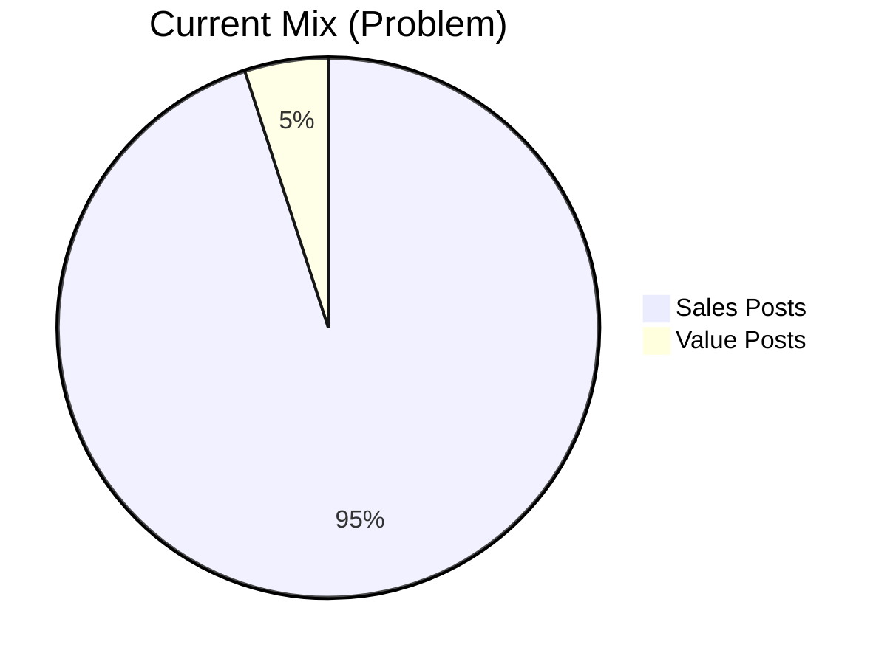
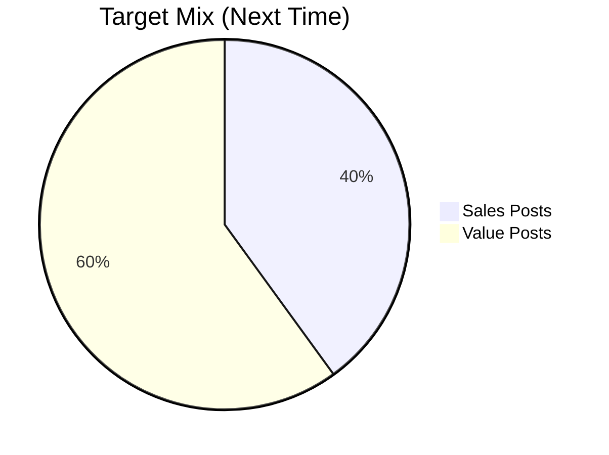
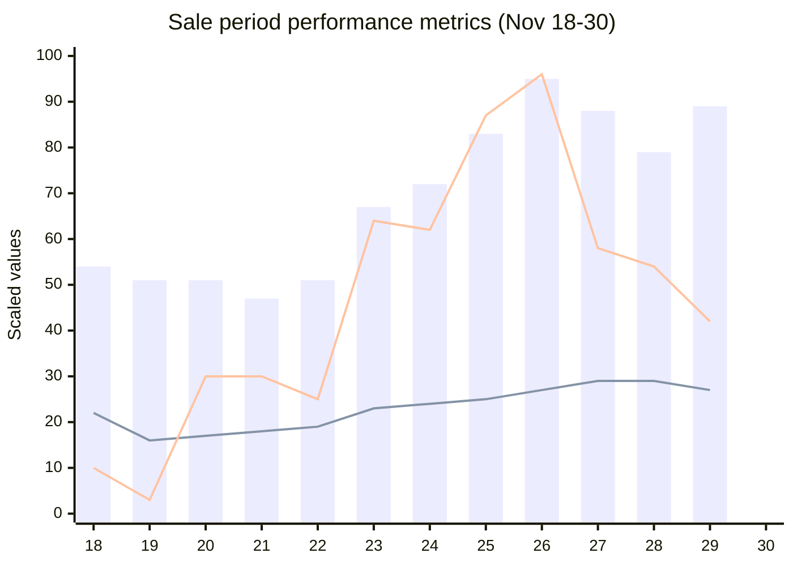
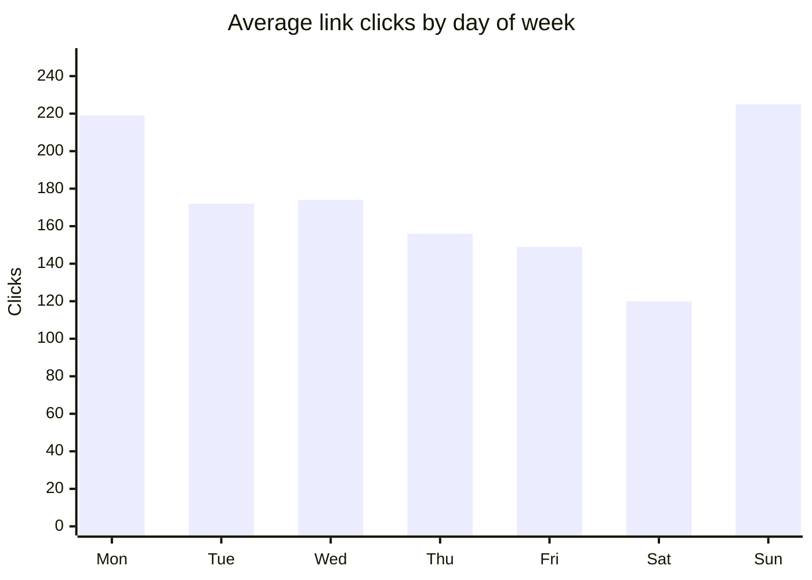

# VL London - Penguin Sales 2025 - Post-Campaign Review

**Summary:**

The Penguin Sales 2025 campaign achieved strong execution through technology and high-volume content. Automated HTML systems and Claude Code captions (93-95% accuracy) enabled 100 posts per week. Campaign execution was strong with better preparation, shop decoration, effective ad performance, and peak engagement from livestream activities on the final day.

The primary challenge was cross-department collaboration: pricing received only 1 week before launch required complete material recreation, last-minute strategy changes caused costly reprints, new products launched without notice, and system errors from rushed execution resulted in customer complaints. Content strategy also suffered with 95% sales / 5% value mix causing engagement drops. Fixes: establish 2-week advance notice protocols for pricing and strategy, implement quality control processes with 3-day lead times, shift content ratio to 40% sales / 60% value maintaining mini-series, and optimise livestream technical setup.

## Table of contents

**Topic 1: Livestream & activities**
- **Good 1.1:** Livestream & activities - Lucky draw drove peak final-day engagement
- **Better 1.1:** Enhance activities - Multiple livestream sessions with tiered prizes
- **Problem 1.2:** Livestream quality - Audio issues affected quality
- **Fix 1.2:** Technical optimisation - Optimise setup and 50/50 demo/product intro mix

**Topic 2: Campaign execution & content strategy**
- **Good 2.1:** Campaign execution - Strong performance with 833k views and +54% growth (Appendix A-B-C)
- **Better 2.1:** Scale campaign execution - Document processes and expand strategic posting
- **Problem 2.2:** Content strategy drop - 95% sales / 5% value mix reduced engagement (Exhibit 1)
- **Fix 2.2:** Balance content strategy - Target 40% sales / 60% value with mini-series

**Topic 3: Technology & automation**
- **Good 3.1:** Technology & automation systems - Automated HTML and Claude Code dramatically improved production speed
- **Better 3.1:** Content workflow enhancement - Shift to executives writing with team review

**Topic 4: Cross-department collaboration**
- **Problem 4.1:** Cross-department collaboration & timing - Inadequate lead time caused pricing delays and quality issues (Exhibit 2)
- **Fix 4.1:** Communication & quality protocols - Establish 2-week advance notice and quality control processes

**Appendices**
- Appendix A: Daily Facebook insights data (Nov 18-30, 2025)
- Appendix B: Performance visualization
- Appendix C: Key performance metrics & insights

## Topic 1: Livestream & activities

### Good 1.1. Livestream & lucky draw activities
Livestream and lucky draw activities increased human interaction and created a strong sale atmosphere. Peak engagement occurred on the final day with many customers participating and purchasing.

**Better: Enhance interactive activities**

- Schedule multiple livestream sessions throughout sale period to sustain engagement momentum
- Introduce tiered lucky draw prizes to encourage earlier participation
- Promote livestream schedule in advance to build anticipation

### Problem 1.2. Livestream quality
Livestream had audio issues that affected quality.

**Fix: Technical optimisation**

- **Technical:** Thi and Cong to discuss optimisation to minimise errors

- **Content format:**
  - Audience prefers product introduction over talkshow with nail artist
  - Target mix: 50% demo (can discuss salon issues during demo, not split into 2 segments) + 50% product introduction (Viet)
  - Consider livestream order closing format - audience preference based on 2 livestreams and comments
  - Requires sales team involvement for implementation

## Topic 2: Campaign execution & content strategy

### Good 2.1. Campaign execution
The team met and exceeded initial post targets with extra content to push sales and increase engagement. Preparation was better and earlier compared to previous years, including printed posters and shop decoration for the sale. The automation system enabled approximately 100 posts per week. Thanks to early preparation of "must-have" activities, the team had time for "good-to-have" activities like livestream and lucky draw. Strategic product posting with specific plans helped push target products, many of which sold more or sold out completely. Some posts included myVL links.

Ad campaigns delivered good results, successfully pushing target products and customer-demanded products. Beautiful visual content compensated for lack of ad follow-up. Cong detected and stopped high frequency ad for London-only campaign in time.

Campaign performance data shows strong results with sustained growth throughout the 2-week period. Total reach achieved **833,100 views** and **282,482 unique viewers**, with myVL link integration generating **1,986 clicks**. Week-over-week comparison reveals building momentum: Week 2 showed **+54% growth in views**, **+37% growth in viewers**, and **+110% growth in link clicks** compared to Week 1. Peak performance occurred on Nov 26-27 with **95,830 views** and **339 link clicks** in a single day, coinciding with livestream and lucky draw activities (see Appendix A and B for detailed data and visualization).

**Better: Scale campaign execution**

- Document and systematise the early preparation process to replicate success consistently
- Expand strategic product posting approach to more product categories
- Develop ad monitoring protocols to catch high frequency issues earlier
- Increase myVL link integration across more posts

### Problem 2.2. Content strategy - drop in engagement
A notable drop in engagement occurred during the sale period. The content mix became heavily skewed toward sales posts (95%) with value content dropping to only 5%. The team stopped producing mini-series content, which had previously provided significant value to the audience. This imbalance meant that followers were bombarded with sales messaging without the supporting value content that builds trust and engagement. The data clearly shows this was a mistake - engagement metrics declined as the value content disappeared.

Additionally, not enough videos were produced this time, limiting content variety and engagement opportunities.

**Exhibit 1: Content mix analysis**

**Fix: Balance content strategy**

- Target content mix: 40% sales posts and 60% value posts (complete reversal of problematic 95/5 split)
- Mini-series content must continue running throughout sale period - do not stop
- Value content supports and carries sales by maintaining audience engagement and trust
- When timing requirements expedited, allocate more time for video production to address content variety gap

## Topic 3: Technology & automation

### Good 3.1. Technology & automation systems
The new automated HTML system was a major success for this sale season. The system dramatically reduced the time required to create marketing materials by allowing the team to simply feed in images and prices, which are then automatically processed into HTML output. This created a single source of truth for pricing across all materials, eliminating inconsistencies that plagued previous campaigns. The speed improvement meant the team could produce sales images for marketing campaigns extremely fast, freeing up time for more strategic work.

Claude Code for caption writing proved highly effective, achieving 93-95% accuracy with only a 5-7% error rate. This automation enabled the team to maintain a high volume output of 70+ posts per week, which would have been difficult to sustain with manual writing. The time saved on writing allowed the team to focus more on content distribution and strategy.

**Better: Content workflow enhancement**

- Shift to executives writing initial captions, with team reviewing and refining them
- Maintains high volume of 70+ posts per week more efficiently
- Leverages automation success while adding strategic oversight

## Topic 4: Cross-department collaboration

### Problem 4.1. Cross-department collaboration & timing
The most significant issue this season was inadequate lead time and communication across departments, manifesting in four critical areas:

**Pricing timeline:** The team received final discounted prices only one week before launch. Marketing materials had to be created in Week -2 based on pricing from the previous sales season. When actual prices arrived in Week -1, the pricing structure and item grouping were completely different from expectations. The team had to recreate all materials in Week -1, but with insufficient time to properly adapt. The sale launched with marketing materials that didn't fully match actual prices.

**Last-minute product launches:** Some new products launched on sale day and needed to be posted immediately. Marketing had unexpected work without proper preparation time. While urgent posts can be done, they won't be perfect quality.

**Strategy changes:** Sale strategy finalised close to sale date, causing pre-prepared plans to change. Example: Already printed posters, then programme changed, requiring costly reprints.

**Price file completeness:** System depends on complete price file from Bang. Can't assume "everyone knows" - products not in file result in no images and no posts for those products.

**System errors:** Images and captions were produced fast through automation, but still had errors leading to some customer complaints. Quality control processes need strengthening.

**Exhibit 2: Timeline comparison**

**What should have happened:**

<table>
<tr><th width="400">Task</th><th width="80">Week -2</th><th width="80">Week -1</th><th width="80">Week 0</th><th width="80">Week 1</th><th width="80">Week 2</th></tr>
<tr><td>1.1 Receive final prices</td><td>████</td><td></td><td></td><td></td><td></td></tr>
<tr><td>1.2 Create/revise materials with final prices</td><td></td><td>████</td><td></td><td></td><td></td></tr>
<tr><td>2.1 Sale Launch</td><td></td><td></td><td>LAUNCH</td><td></td><td></td></tr>
<tr><td>2.2 Sales</td><td></td><td></td><td></td><td>████</td><td>████</td></tr>
</table>

**What actually happened:**

<table>
<tr><th width="400">Task</th><th width="80">Week -2</th><th width="80">Week -1</th><th width="80">Week 0</th><th width="80">Week 1</th><th width="80">Week 2</th></tr>
<tr><td>1.1 Create materials based on previous sales prices</td><td>████</td><td></td><td></td><td></td><td></td></tr>
<tr><td>1.2 Prices received - grouping structure totally different</td><td></td><td>████</td><td></td><td></td><td></td></tr>
<tr><td>1.3 Create all materials again</td><td></td><td>████</td><td></td><td></td><td></td></tr>
<tr><td>2.1 Sale Launch (materials don't match)</td><td></td><td></td><td>LAUNCH</td><td></td><td></td></tr>
<tr><td>2.2 Sales</td><td></td><td></td><td></td><td>████</td><td>████</td></tr>
</table>

**Fix: Establish clear communication & quality protocols**

- **Pricing timeline:** Receive final pricing by Week -2 or earlier to create accurate marketing materials from the start rather than wasting time on complete redos. Better planning with more lead time prevents rushed, high-pressure situations.

- **Advance notice requirements:** Sale timing and strategy must inform Marketing 2 weeks in advance. Can inform sales team later, but Marketing needs basic info: timing, sale programme details (extra 10% off...?). Price file must be finalised at least 1 week before and sent to Marketing.

- **Product launch coordination:** Notify Marketing in advance for new product launches to allow time for photo preparation and posts.

- **Complete price files:** Price file must include all products with complete information clearly written. No assumptions about "everyone knows" - complete coverage needed for all sale products.

- **Quality control process:** Image and caption system - when edited, should be final and done with no more errors. Images can start 3 days before launch (realistic timeline since price depends on Bang). Captions depend on which images will be uploaded (including supplementary images requiring description). Images and captions can flexibly start 3 days before, but must be accurate - minimise rushing and errors.

---

## Appendix A: Daily Facebook insights data (Nov 18-30, 2025)

| Date | Views | Viewers | Link Clicks | Interactions | Page Visits | New Follows |
|------|------:|--------:|------------:|-------------:|------------:|------------:|
| Nov 18 | 54,526 | 22,232 | 37 | 318 | 1,623 | 10 |
| Nov 19 | 51,837 | 16,698 | 10 | 119 | 1,216 | 11 |
| Nov 20 | 51,212 | 17,664 | 107 | 96 | 1,014 | 7 |
| Nov 21 | 47,820 | 18,722 | 106 | 133 | 802 | 8 |
| Nov 22 | 51,329 | 19,353 | 90 | 89 | 1,133 | 10 |
| Nov 23 | 67,575 | 23,360 | 225 | 92 | 1,640 | 10 |
| Nov 24 | 72,525 | 24,658 | 219 | 223 | 1,708 | 9 |
| Nov 25 | 83,603 | 25,777 | 307 | 195 | 1,667 | 13 |
| Nov 26 | 95,830 | 27,653 | 339 | 274 | 1,603 | 12 |
| Nov 27 | 88,517 | 29,074 | 205 | 174 | 1,443 | 6 |
| Nov 28 | 79,222 | 29,595 | 192 | 131 | 1,144 | 5 |
| Nov 29 | 89,104 | 27,696 | 149 | 127 | 2,206 | 13 |
| **Total** | **833,100** | **282,482** | **1,986** | **1,971** | **17,199** | **114** |
| **Daily avg** | **69,425** | **23,540** | **166** | **164** | **1,433** | **9.5** |

## Appendix B: Performance visualization

**Legend:**
- **Blue bars** = Views (thousands)
- **Orange line** = Viewers (scaled: ÷10)
- **Green line** = Link clicks (scaled: ÷3.5)

**Actual values:**
- **Views:** 47,820 - 95,830 daily (bars show values in thousands)
- **Viewers:** 16,698 - 29,595 daily (line scaled by ÷10 for visualization)
- **Link clicks:** 10 - 339 daily (line scaled by ÷3.5 for visualization)

## Appendix C: Key performance metrics & insights

**Weekly performance comparison**

| Metric | Week 1 Daily Avg | Week 2 Daily Avg | Difference |
|--------|-----------------|-----------------|------------|
| Views | 56,689 | 87,255 | +53.9% |
| Viewers | 20,384 | 27,959 | +37.2% |
| Interactions | 153 | 180 | +17.9% |
| Link clicks | 113 | 238 | +110.2% |
| Page visits | 1,305 | 1,613 | +23.6% |
| New follows | 9.3 | 9.8 | +5.5% |

**Day-of-week performance patterns**

| Day | Avg Views | Avg Link Clicks | Observation |
|-----|-----------|-----------------|-------------|
| Monday | 72,525 | 219 | High engagement |
| Tuesday | 69,064 | 172 | Strong views |
| Wednesday | 73,834 | 174 | Peak views |
| Thursday | 69,864 | 156 | Above average |
| Friday | 63,521 | 149 | Lower engagement |
| Saturday | 70,216 | 120 | Lowest clicks |
| Sunday | 67,575 | 225 | Highest clicks |

