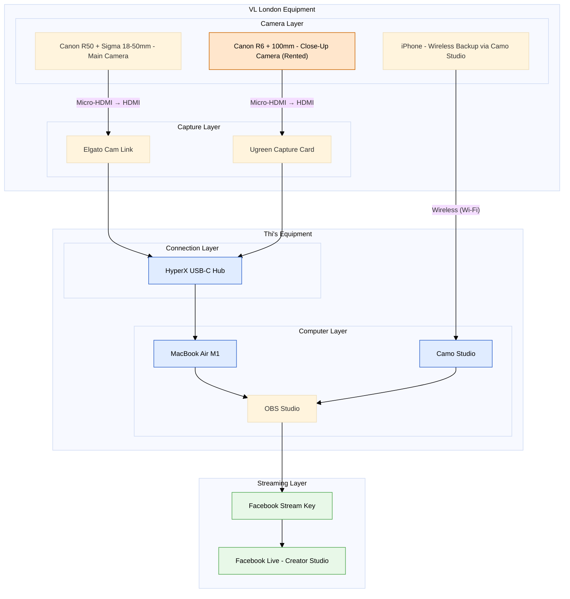
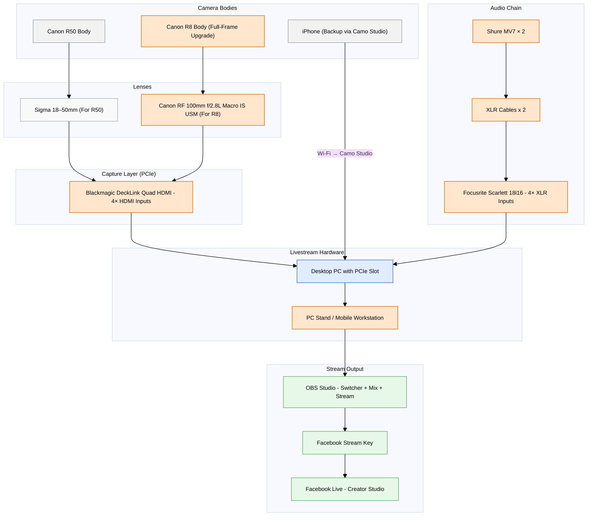

# VL London Streaming Setup

## Current Setup (As-Is)

---

## Proposed New Setup

---

## Current Equipment (Already Have)

| Category | Item | Notes |
|----------|------|-------|
| **Camera Body** | Canon R50 | APS-C sensor, 1.6x crop factor |
| **Primary Lens** | Sigma 18-50mm f/2.8 DC DN | For R50, versatile zoom |
| **Backup Camera** | iPhone | Wireless via Camo Studio |
| **Video Capture** | Elgato Cam Link | USB HDMI capture |
| **Video Capture** | Ugreen Capture Card | USB HDMI capture |
| **Computer** | Desktop PC | With PCIe slot available |
| **Connection Hub** | HyperX USB-C Hub | For connecting capture cards |
| **Streaming Software** | OBS Studio | Free, open-source |
| **Camera Software** | Camo Studio | For iPhone wireless input |
| **Streaming Platform** | Facebook Live | Via Creator Studio (VL London account) |

---

## Proposed Purchases - Budget Options

| Category | Low Budget | Medium Budget | High Budget |
|----------|---------------------|------------------------|----------------------|
| **Camera** | Canon R50V (£900) | Canon R8 Body (£1,500) | Canon R6 Mark II (£2,200) |
| **Lens** | RF 50mm f/1.8 STM (£200) *80mm equiv. with 1.6x crop* | RF 100mm f/2.8L Macro IS USM (£1,200) | RF 100mm f/2.8L Macro IS USM (£1,200) |
| **Video Capture** | Elgato Cam Link Pro (£250) | DeckLink Quad HDMI PCIe (£400) | DeckLink 8K Pro (£600) |
| **Microphone** | Rode PodMic × 2 (£200) | Shure MV7 × 2 (£500) | Shure SM7B × 2 (£700) |
| **Audio Cables** | XLR Cables × 2 (£40) | XLR Cables × 2 (£40) | XLR Cables × 2 (£40) |
| **Audio Interface** | Focusrite 2i2 4th Gen (£180) | Focusrite Scarlett 18i8 3rd Gen (£350) | Focusrite 18i16 3rd Gen (£450) |
| **Hardware** | PC Stand (£200) | PC Stand (£200) | PC Stand (£200) |
| **TOTAL** | **£2,770** | **£4,190** | **£5,390** |

---

## Signal Flow

| Path | Flow |
|------|------|
| Video | Cameras → Lenses → DeckLink Quad HDMI → PC → OBS → Facebook Live |
| Audio | Shure MV7 Mics → XLR Cables → Focusrite 18i16 → PC → OBS → Facebook Live |
| Backup | iPhone → Wi-Fi (Camo Studio) → PC → OBS |

